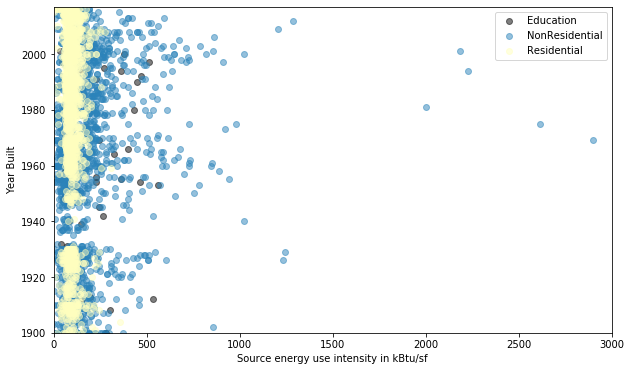
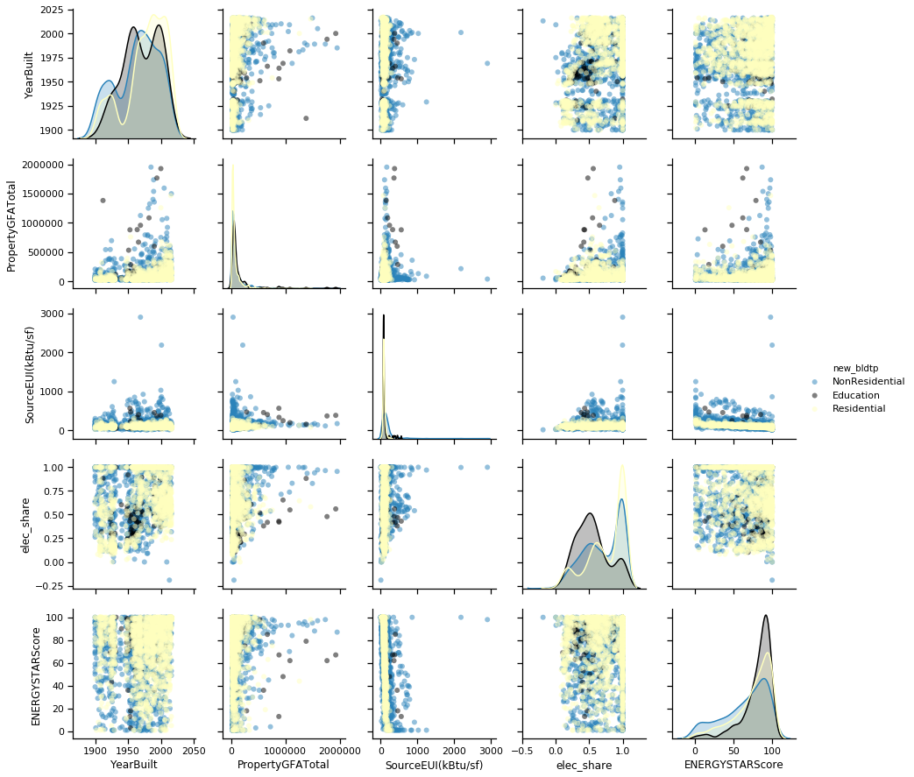
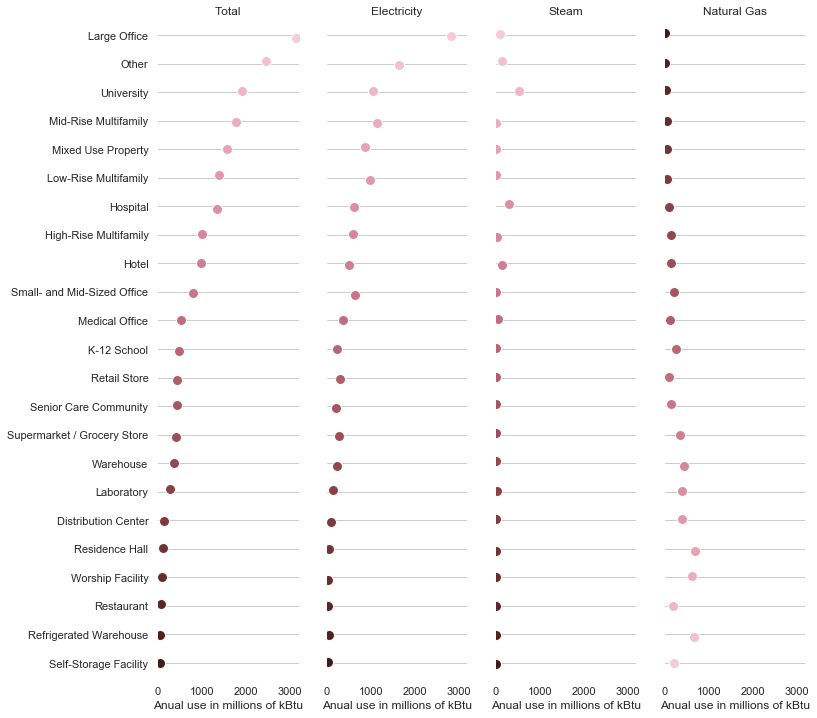
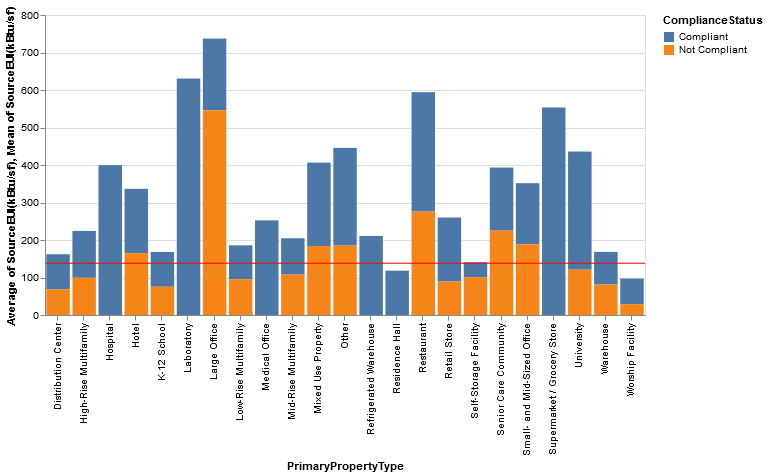
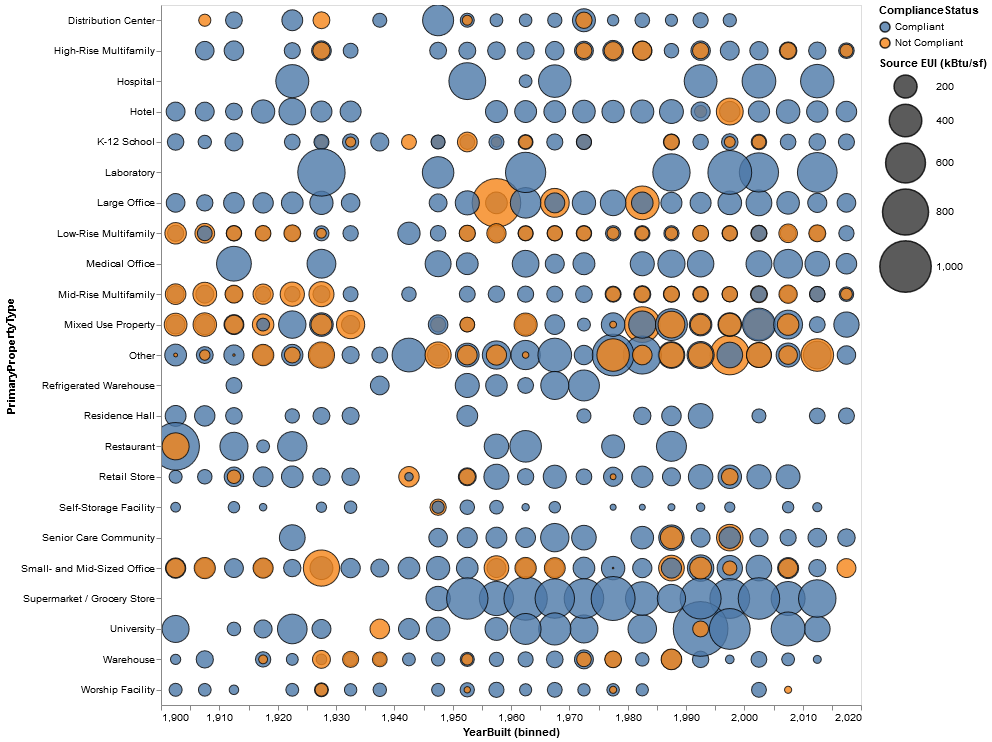
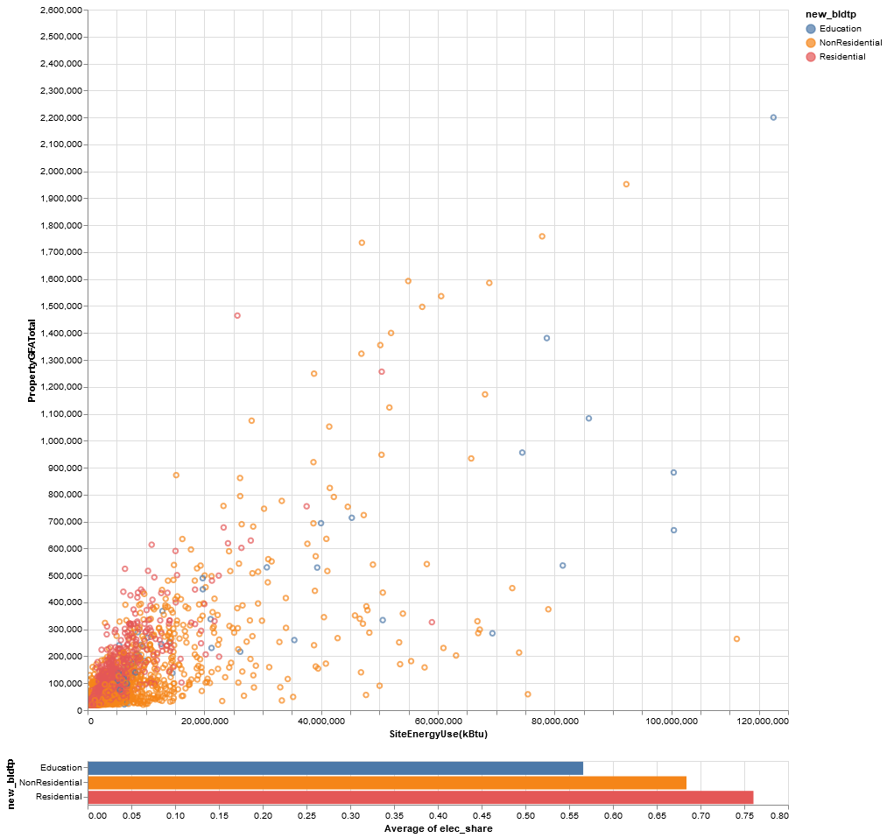

# Assignment 02 - Leonardo Harth

## Seattle's buildings energy consumption and efficiency data visualization

### CPLN 691 / MUSA 620

### Instructor: Nick Hand
### Teaching Assistant: Chloe Sheen


## Part I - Initial Data Exploration and Plots with Matplotlib

In this assignment, I aim to understand different aspects of energy consumption patterns for buildings in the city of Seattle. The data comes from the Seattle Open Data Portal. The dataset and metadata can be accessed here: https://data.seattle.gov/dataset/2017-Building-Energy-Benchmarking/qxjw-iwsh

Initial settings and data reading:


```python
import numpy as np
import pandas as pd
from matplotlib import pyplot as plt
import seaborn as sns
import altair as alt
alt.renderers.enable('notebook')
%matplotlib inline
seattle_energy = pd.read_csv("2017_Building_Energy_Benchmarking.csv")
seattle_energy
```


<div>
<style scoped>
    .dataframe tbody tr th:only-of-type {
        vertical-align: middle;
    }

    .dataframe tbody tr th {
        vertical-align: top;
    }

    .dataframe thead th {
        text-align: right;
    }
</style>
<table border="1" class="dataframe">
  <thead>
    <tr style="text-align: right;">
      <th></th>
      <th>OSEBuildingID</th>
      <th>DataYear</th>
      <th>BuildingType</th>
      <th>PrimaryPropertyType</th>
      <th>PropertyName</th>
      <th>Address</th>
      <th>City</th>
      <th>State</th>
      <th>ZipCode</th>
      <th>TaxParcelIdentificationNumber</th>
      <th>...</th>
      <th>SteamUse(kBtu)</th>
      <th>Electricity(kWh)</th>
      <th>Electricity(kBtu)</th>
      <th>NaturalGas(therms)</th>
      <th>NaturalGas(kBtu)</th>
      <th>TotalGHGEmissions</th>
      <th>GHGEmissionsIntensity</th>
      <th>DefaultData</th>
      <th>ComplianceStatus</th>
      <th>Outlier</th>
    </tr>
  </thead>
  <tbody>
    <tr>
      <th>0</th>
      <td>1</td>
      <td>2017</td>
      <td>NonResidential</td>
      <td>Hotel</td>
      <td>Mayflower park hotel</td>
      <td>405 Olive way</td>
      <td>Seattle</td>
      <td>WA</td>
      <td>98101.0</td>
      <td>0659000030</td>
      <td>...</td>
      <td>2122835.75</td>
      <td>1.157783e+06</td>
      <td>3.950356e+06</td>
      <td>12884.63</td>
      <td>1288462.99</td>
      <td>197.63</td>
      <td>2.235</td>
      <td>N</td>
      <td>Compliant</td>
      <td>NaN</td>
    </tr>
    <tr>
      <th>1</th>
      <td>2</td>
      <td>2017</td>
      <td>NonResidential</td>
      <td>Hotel</td>
      <td>Paramount Hotel</td>
      <td>724 Pine street</td>
      <td>Seattle</td>
      <td>WA</td>
      <td>98101.0</td>
      <td>0659000220</td>
      <td>...</td>
      <td>NaN</td>
      <td>8.841610e+05</td>
      <td>3.016757e+06</td>
      <td>47880.87</td>
      <td>4788086.72</td>
      <td>266.78</td>
      <td>2.576</td>
      <td>N</td>
      <td>Compliant</td>
      <td>NaN</td>
    </tr>
    <tr>
      <th>2</th>
      <td>3</td>
      <td>2017</td>
      <td>Campus</td>
      <td>Hotel</td>
      <td>84SC9-The Westin Seattle</td>
      <td>1900 5th Avenue</td>
      <td>Seattle</td>
      <td>WA</td>
      <td>98101.0</td>
      <td>0659000475</td>
      <td>...</td>
      <td>24313482.00</td>
      <td>1.427692e+07</td>
      <td>4.871284e+07</td>
      <td>14440.00</td>
      <td>1444000.10</td>
      <td>1570.75</td>
      <td>1.643</td>
      <td>N</td>
      <td>Compliant</td>
      <td>NaN</td>
    </tr>
    <tr>
      <th>3</th>
      <td>5</td>
      <td>2017</td>
      <td>NonResidential</td>
      <td>Hotel</td>
      <td>HOTEL MAX</td>
      <td>620 STEWART ST</td>
      <td>SEATTLE</td>
      <td>WA</td>
      <td>98101.0</td>
      <td>0659000640</td>
      <td>...</td>
      <td>2228119.50</td>
      <td>8.817449e+05</td>
      <td>3.008514e+06</td>
      <td>21355.88</td>
      <td>2135587.89</td>
      <td>244.32</td>
      <td>3.984</td>
      <td>N</td>
      <td>Compliant</td>
      <td>NaN</td>
    </tr>
    <tr>
      <th>4</th>
      <td>8</td>
      <td>2017</td>
      <td>NonResidential</td>
      <td>Hotel</td>
      <td>WARWICK SEATTLE HOTEL (ID8)</td>
      <td>401 LENORA ST</td>
      <td>Seattle</td>
      <td>WA</td>
      <td>98121.0</td>
      <td>0659000970</td>
      <td>...</td>
      <td>NaN</td>
      <td>1.523506e+06</td>
      <td>5.198202e+06</td>
      <td>91375.76</td>
      <td>9137575.78</td>
      <td>506.80</td>
      <td>2.886</td>
      <td>N</td>
      <td>Compliant</td>
      <td>NaN</td>
    </tr>
    <tr>
      <th>...</th>
      <td>...</td>
      <td>...</td>
      <td>...</td>
      <td>...</td>
      <td>...</td>
      <td>...</td>
      <td>...</td>
      <td>...</td>
      <td>...</td>
      <td>...</td>
      <td>...</td>
      <td>...</td>
      <td>...</td>
      <td>...</td>
      <td>...</td>
      <td>...</td>
      <td>...</td>
      <td>...</td>
      <td>...</td>
      <td>...</td>
      <td>...</td>
    </tr>
    <tr>
      <th>3456</th>
      <td>50265</td>
      <td>2017</td>
      <td>Multifamily LR (1-4)</td>
      <td>NaN</td>
      <td>NaN</td>
      <td>1861 16TH AVE</td>
      <td>SEATTLE</td>
      <td>WA</td>
      <td>NaN</td>
      <td>8080400145</td>
      <td>...</td>
      <td>NaN</td>
      <td>NaN</td>
      <td>NaN</td>
      <td>NaN</td>
      <td>NaN</td>
      <td>0.00</td>
      <td>0.000</td>
      <td>N</td>
      <td>Compliant</td>
      <td>NaN</td>
    </tr>
    <tr>
      <th>3457</th>
      <td>50268</td>
      <td>2017</td>
      <td>Multifamily MR (5-9)</td>
      <td>Mid-Rise Multifamily</td>
      <td>Decibel Apartments</td>
      <td>301 12th Ave</td>
      <td>Seattle</td>
      <td>WA</td>
      <td>98122.0</td>
      <td>2197600742</td>
      <td>...</td>
      <td>NaN</td>
      <td>1.682466e+05</td>
      <td>5.740574e+05</td>
      <td>7750.23</td>
      <td>775022.95</td>
      <td>43.54</td>
      <td>0.625</td>
      <td>N</td>
      <td>Compliant</td>
      <td>NaN</td>
    </tr>
    <tr>
      <th>3458</th>
      <td>50272</td>
      <td>2017</td>
      <td>Multifamily MR (5-9)</td>
      <td>Mid-Rise Multifamily</td>
      <td>Mad Flats</td>
      <td>1523 E. Madison Street</td>
      <td>Seattle</td>
      <td>WA</td>
      <td>98122.0</td>
      <td>7234600220</td>
      <td>...</td>
      <td>NaN</td>
      <td>1.472702e+05</td>
      <td>5.024859e+05</td>
      <td>3999.97</td>
      <td>399997.00</td>
      <td>23.32</td>
      <td>1.119</td>
      <td>N</td>
      <td>Compliant</td>
      <td>NaN</td>
    </tr>
    <tr>
      <th>3459</th>
      <td>50284</td>
      <td>2017</td>
      <td>Multifamily MR (5-9)</td>
      <td>Mid-Rise Multifamily</td>
      <td>Vive</td>
      <td>1516 NW 51st St</td>
      <td>Seattle</td>
      <td>WA</td>
      <td>98107.0</td>
      <td>2767701650</td>
      <td>...</td>
      <td>NaN</td>
      <td>5.344369e+05</td>
      <td>1.823499e+06</td>
      <td>NaN</td>
      <td>NaN</td>
      <td>7.54</td>
      <td>0.112</td>
      <td>N</td>
      <td>Compliant</td>
      <td>NaN</td>
    </tr>
    <tr>
      <th>3460</th>
      <td>50289</td>
      <td>2017</td>
      <td>Multifamily MR (5-9)</td>
      <td>Mid-Rise Multifamily</td>
      <td>Millennium Tower - Residential</td>
      <td>715 2nd Ave</td>
      <td>Seattle</td>
      <td>WA</td>
      <td>98104.0</td>
      <td>5530500000</td>
      <td>...</td>
      <td>NaN</td>
      <td>4.684949e+05</td>
      <td>1.598505e+06</td>
      <td>19712.93</td>
      <td>1971292.77</td>
      <td>111.31</td>
      <td>1.741</td>
      <td>N</td>
      <td>Compliant</td>
      <td>NaN</td>
    </tr>
  </tbody>
</table>
<p>3461 rows × 45 columns</p>
</div>


I am interested in categorizing my visualizations based on building type, so I will first look at the distribution:


```python
print(seattle_energy['BuildingType'].value_counts(dropna =False))
```

    NonResidential          1480
    Multifamily LR (1-4)    1042
    Multifamily MR (5-9)     620
    Multifamily HR (10+)     112
    SPS-District K-12         99
    Nonresidential COS        67
    Campus                    39
    Nonresidential WA          2
    Name: BuildingType, dtype: int64
    

I will remap these categories to make it more concise:


```python
buildingtype_map =  {'NonResidential':'NonResidential','Multifamily LR (1-4)':'Residential',
                     'Multifamily MR (5-9)':'Residential','Multifamily HR (10+)':'Residential',
                     'SPS-District K-12':'Education','Nonresidential COS':'NonResidential',
                     'Nonresidential WA':'NonResidential', 'Campus':'Education'}

seattle_energy['new_bldtp'] = seattle_energy['BuildingType'].map(buildingtype_map)

print(seattle_energy['new_bldtp'].value_counts(dropna =False))
```

    Residential       1774
    NonResidential    1549
    Education          138
    Name: new_bldtp, dtype: int64
    

I will focus this analysis on the source energy use intensity of the buildings. From the dataset metadata: "__Source Energy Use Intensity (EUI) is a property's Source Energy Use divided by its gross floor area. Source Energy Use is the annual energy used to operate the property, including losses from generation, transmission, & distribution. Source EUI is measured in thousands of British thermal units (kBtu) per square foot__". This helps to account for differences in size.

I am also interested in visualizing the percentage of electrical energy relative to total energy consumption, so I am creating this new variable:


```python
seattle_energy['elec_share'] = seattle_energy['Electricity(kBtu)']/seattle_energy['SiteEnergyUse(kBtu)']
seattle_energy['elec_share'].describe()
```


    count    3425.000000
    mean        0.718213
    std         0.281630
    min        -0.191569
    25%         0.508608
    50%         0.749997
    75%         1.000000
    max         1.000009
    Name: elec_share, dtype: float64


I would like to pose a first question to the data: are newer buildings (or newly renovated, as the data is collected) more efficient than the older ones? First, I will create a colormap according to my categories. Since there are substantially less educational buildings, I will use a higher contrast for this category.


```python
bldType_colormap = {"Residential":"#ffffbf", "NonResidential" : "#2b83ba", "Education" : "#000000"}
bldType_colormap 
```


    {'Residential': '#ffffbf', 'NonResidential': '#2b83ba', 'Education': '#000000'}


Then I will use Matplotlib to build a scatterplot of source energy use intensity vs year built. The reason for using Matplotlib is that this is a simple plot, so I can handle it well with this library's resources. First, I will summarize the data to learn how to deal with outliers.


```python
seattle_energy['SourceEUI(kBtu/sf)'].describe()
```


    count      3428.000000
    mean        359.161960
    std       12944.326743
    min           0.000000
    25%          77.700000
    50%         100.200000
    75%         147.125000
    max      757968.500000
    Name: SourceEUI(kBtu/sf), dtype: float64


```python
fig, ax = plt.subplots(figsize=(10, 6))

for bldType, group in seattle_energy.groupby("new_bldtp"):

    print(f"Plotting {bldType}...")

    ax.scatter(
        group["SourceEUI(kBtu/sf)"], # Source energy use intensity
        group["YearBuilt"], # year the building was built
        marker="o",
        label=bldType,
        color=bldType_colormap[bldType],
        alpha=0.5,
    )
    
ax.legend(loc="best")
ax.set_xlabel("Source energy use intensity in kBtu/sf")
ax.set_ylabel("Year Built")
ax.set_xlim(0, 3000) # I removed one outlier to get a better feeling of the data
ax.set_ylim(1900, 2017) 
ax.grid(False)
```

    Plotting Education...
    Plotting NonResidential...
    Plotting Residential...
    





While residential and educational buildings seem almost unaffected by the age factor, it seems that newer nonresidential buildings are more energy-demanding.


## Part II - Seaborn Charts

Since there is a large number of variables and great variance, I will start by looking at some correlations. For that, I will take advantage of the pairplot() function of Seaborn. I will look at the year built, the total property area, the Source energy use intensity, the share of electricity from total energy consumption, and the ENERGYSTARScore (the benchmarking they use).


```python
variables = ["new_bldtp","YearBuilt", "PropertyGFATotal", "SourceEUI(kBtu/sf)", "elec_share", "ENERGYSTARScore"]

sns.set_context("notebook", font_scale=1)

sns.pairplot(
    seattle_energy[variables].dropna(),
    palette= bldType_colormap,
    hue="new_bldtp",
    plot_kws= dict(alpha=0.5, edgecolor="none")
)
```


    <seaborn.axisgrid.PairGrid at 0x24ac2c2bdd8>





This plot gives us a huge amount of information:

1) Older buildings seem to have proportionally higher ENERGYSTARScore than the newer buildings, they use more electricity as a share of total energy consumption, they have lower source energy use intensity, and are usually smaller properties.

2) Larger buildings have on average higher ENERGYSTARScores, they use more electricity as a share of total energy consumption, and have lower source energy use intensity.

3) As expected, the source energy use intensity tends to decrease when the ENERGYSTARScore increases. The share of electricity use is higher in buildings with higher source energy use intensity.

4) The ENERGYSTARScore seems to be unaffected by the use of electricity as a share of total energy consumption.

### Note
Since  from here on I will look at averages, I will remove **one single outlier** that is more than 260 times higher than the second-highest value and disturbs my average calculations. Please note below that the count of observations comes down from 3428 to 3427.


```python
seattle_energy2 = seattle_energy.loc[seattle_energy['SourceEUI(kBtu/sf)']<3000]
seattle_energy2['SourceEUI(kBtu/sf)'].describe()
```


    count    3427.000000
    mean      138.091246
    std       146.599109
    min         0.000000
    25%        77.700000
    50%       100.200000
    75%       147.000000
    max      2902.500000
    Name: SourceEUI(kBtu/sf), dtype: float64


I want to use another Seaborn pairplot to visualize the composition of energy use in different building types, so I'll start grouping them:


```python
# group by property type, get anual total use per energy type
energy_by_prop1 = seattle_energy2.groupby(['PrimaryPropertyType'])['SiteEnergyUse(kBtu)'].sum()
energy_by_prop1 = energy_by_prop1.reset_index()
energy_by_prop2 = seattle_energy2.groupby(['PrimaryPropertyType'])['Electricity(kBtu)'].sum()
energy_by_prop2 = energy_by_prop2.reset_index()
energy_by_prop3 = seattle_energy2.groupby(['PrimaryPropertyType'])['SteamUse(kBtu)'].sum()
energy_by_prop3 = energy_by_prop3.reset_index()
energy_by_prop4 = seattle_energy2.groupby(['PrimaryPropertyType'])['NaturalGas(kBtu)'].sum()
energy_by_prop4 = energy_by_prop4.reset_index()
energy_by_prop = pd.merge(energy_by_prop1, energy_by_prop2, on=['PrimaryPropertyType'], how='left')
energy_by_prop = pd.merge(energy_by_prop, energy_by_prop3, on=['PrimaryPropertyType'], how='left')
energy_by_prop = pd.merge(energy_by_prop, energy_by_prop4, on=['PrimaryPropertyType'], how='left')

energy_by_prop
```


<div>
<style scoped>
    .dataframe tbody tr th:only-of-type {
        vertical-align: middle;
    }

    .dataframe tbody tr th {
        vertical-align: top;
    }

    .dataframe thead th {
        text-align: right;
    }
</style>
<table border="1" class="dataframe">
  <thead>
    <tr style="text-align: right;">
      <th></th>
      <th>PrimaryPropertyType</th>
      <th>SiteEnergyUse(kBtu)</th>
      <th>Electricity(kBtu)</th>
      <th>SteamUse(kBtu)</th>
      <th>NaturalGas(kBtu)</th>
    </tr>
  </thead>
  <tbody>
    <tr>
      <th>0</th>
      <td>Distribution Center</td>
      <td>1.343089e+08</td>
      <td>8.666605e+07</td>
      <td>0.000000e+00</td>
      <td>4.764279e+07</td>
    </tr>
    <tr>
      <th>1</th>
      <td>High-Rise Multifamily</td>
      <td>9.968619e+08</td>
      <td>6.000341e+08</td>
      <td>2.281858e+07</td>
      <td>4.437434e+08</td>
    </tr>
    <tr>
      <th>2</th>
      <td>Hospital</td>
      <td>1.334779e+09</td>
      <td>6.274936e+08</td>
      <td>3.040046e+08</td>
      <td>4.032808e+08</td>
    </tr>
    <tr>
      <th>3</th>
      <td>Hotel</td>
      <td>9.826730e+08</td>
      <td>4.938383e+08</td>
      <td>1.480981e+08</td>
      <td>3.393568e+08</td>
    </tr>
    <tr>
      <th>4</th>
      <td>K-12 School</td>
      <td>4.743986e+08</td>
      <td>2.208653e+08</td>
      <td>6.215911e+05</td>
      <td>2.528803e+08</td>
    </tr>
    <tr>
      <th>5</th>
      <td>Laboratory</td>
      <td>2.796257e+08</td>
      <td>1.377637e+08</td>
      <td>3.410039e+07</td>
      <td>1.077615e+08</td>
    </tr>
    <tr>
      <th>6</th>
      <td>Large Office</td>
      <td>3.136449e+09</td>
      <td>2.830041e+09</td>
      <td>9.769606e+07</td>
      <td>2.086445e+08</td>
    </tr>
    <tr>
      <th>7</th>
      <td>Low-Rise Multifamily</td>
      <td>1.396336e+09</td>
      <td>9.923946e+08</td>
      <td>3.752233e+06</td>
      <td>4.008415e+08</td>
    </tr>
    <tr>
      <th>8</th>
      <td>Medical Office</td>
      <td>5.139644e+08</td>
      <td>3.703585e+08</td>
      <td>3.907411e+07</td>
      <td>1.045317e+08</td>
    </tr>
    <tr>
      <th>9</th>
      <td>Mid-Rise Multifamily</td>
      <td>1.785794e+09</td>
      <td>1.150158e+09</td>
      <td>1.442010e+07</td>
      <td>6.218171e+08</td>
    </tr>
    <tr>
      <th>10</th>
      <td>Mixed Use Property</td>
      <td>1.561849e+09</td>
      <td>8.717517e+08</td>
      <td>1.170320e+07</td>
      <td>6.783938e+08</td>
    </tr>
    <tr>
      <th>11</th>
      <td>Other</td>
      <td>2.468038e+09</td>
      <td>1.650011e+09</td>
      <td>1.451842e+08</td>
      <td>6.611461e+08</td>
    </tr>
    <tr>
      <th>12</th>
      <td>Refrigerated Warehouse</td>
      <td>4.287127e+07</td>
      <td>3.879949e+07</td>
      <td>0.000000e+00</td>
      <td>4.071774e+06</td>
    </tr>
    <tr>
      <th>13</th>
      <td>Residence Hall</td>
      <td>1.079054e+08</td>
      <td>5.911441e+07</td>
      <td>6.007723e+06</td>
      <td>4.278324e+07</td>
    </tr>
    <tr>
      <th>14</th>
      <td>Restaurant</td>
      <td>5.868554e+07</td>
      <td>2.139133e+07</td>
      <td>3.258202e+06</td>
      <td>3.465370e+07</td>
    </tr>
    <tr>
      <th>15</th>
      <td>Retail Store</td>
      <td>4.428622e+08</td>
      <td>3.095430e+08</td>
      <td>8.267952e+06</td>
      <td>1.250512e+08</td>
    </tr>
    <tr>
      <th>16</th>
      <td>Self-Storage Facility</td>
      <td>3.860824e+07</td>
      <td>2.475606e+07</td>
      <td>0.000000e+00</td>
      <td>1.385218e+07</td>
    </tr>
    <tr>
      <th>17</th>
      <td>Senior Care Community</td>
      <td>4.314587e+08</td>
      <td>2.069267e+08</td>
      <td>1.459961e+07</td>
      <td>2.099324e+08</td>
    </tr>
    <tr>
      <th>18</th>
      <td>Small- and Mid-Sized Office</td>
      <td>7.966194e+08</td>
      <td>6.392011e+08</td>
      <td>1.324332e+07</td>
      <td>1.433954e+08</td>
    </tr>
    <tr>
      <th>19</th>
      <td>Supermarket / Grocery Store</td>
      <td>4.159623e+08</td>
      <td>2.666494e+08</td>
      <td>0.000000e+00</td>
      <td>1.493129e+08</td>
    </tr>
    <tr>
      <th>20</th>
      <td>University</td>
      <td>1.918931e+09</td>
      <td>1.061266e+09</td>
      <td>5.259382e+08</td>
      <td>1.785207e+08</td>
    </tr>
    <tr>
      <th>21</th>
      <td>Warehouse</td>
      <td>3.701175e+08</td>
      <td>2.334669e+08</td>
      <td>0.000000e+00</td>
      <td>1.366506e+08</td>
    </tr>
    <tr>
      <th>22</th>
      <td>Worship Facility</td>
      <td>9.234292e+07</td>
      <td>3.175607e+07</td>
      <td>2.886938e+06</td>
      <td>5.769991e+07</td>
    </tr>
  </tbody>
</table>
</div>


The units are too large, so i will reformat them to build a more relatable chart.


```python
# Transform the data from kBtu to millions of Kbtu

energy_by_prop['SiteEnergyUse(kBtu)'] = energy_by_prop['SiteEnergyUse(kBtu)']/1000000
energy_by_prop['Electricity(kBtu)'] = energy_by_prop['Electricity(kBtu)']/1000000
energy_by_prop['SteamUse(kBtu)'] = energy_by_prop['SteamUse(kBtu)']/1000000
energy_by_prop['NaturalGas(kBtu)'] = energy_by_prop['NaturalGas(kBtu)']/1000000
energy_by_prop
```


<div>
<style scoped>
    .dataframe tbody tr th:only-of-type {
        vertical-align: middle;
    }

    .dataframe tbody tr th {
        vertical-align: top;
    }

    .dataframe thead th {
        text-align: right;
    }
</style>
<table border="1" class="dataframe">
  <thead>
    <tr style="text-align: right;">
      <th></th>
      <th>PrimaryPropertyType</th>
      <th>SiteEnergyUse(kBtu)</th>
      <th>Electricity(kBtu)</th>
      <th>SteamUse(kBtu)</th>
      <th>NaturalGas(kBtu)</th>
    </tr>
  </thead>
  <tbody>
    <tr>
      <th>0</th>
      <td>Distribution Center</td>
      <td>134.308859</td>
      <td>86.666055</td>
      <td>0.000000</td>
      <td>47.642794</td>
    </tr>
    <tr>
      <th>1</th>
      <td>High-Rise Multifamily</td>
      <td>996.861879</td>
      <td>600.034089</td>
      <td>22.818577</td>
      <td>443.743410</td>
    </tr>
    <tr>
      <th>2</th>
      <td>Hospital</td>
      <td>1334.779112</td>
      <td>627.493643</td>
      <td>304.004628</td>
      <td>403.280770</td>
    </tr>
    <tr>
      <th>3</th>
      <td>Hotel</td>
      <td>982.672961</td>
      <td>493.838298</td>
      <td>148.098112</td>
      <td>339.356820</td>
    </tr>
    <tr>
      <th>4</th>
      <td>K-12 School</td>
      <td>474.398639</td>
      <td>220.865307</td>
      <td>0.621591</td>
      <td>252.880350</td>
    </tr>
    <tr>
      <th>5</th>
      <td>Laboratory</td>
      <td>279.625681</td>
      <td>137.763749</td>
      <td>34.100388</td>
      <td>107.761528</td>
    </tr>
    <tr>
      <th>6</th>
      <td>Large Office</td>
      <td>3136.449281</td>
      <td>2830.041011</td>
      <td>97.696057</td>
      <td>208.644544</td>
    </tr>
    <tr>
      <th>7</th>
      <td>Low-Rise Multifamily</td>
      <td>1396.335723</td>
      <td>992.394634</td>
      <td>3.752233</td>
      <td>400.841512</td>
    </tr>
    <tr>
      <th>8</th>
      <td>Medical Office</td>
      <td>513.964397</td>
      <td>370.358516</td>
      <td>39.074111</td>
      <td>104.531729</td>
    </tr>
    <tr>
      <th>9</th>
      <td>Mid-Rise Multifamily</td>
      <td>1785.794218</td>
      <td>1150.158002</td>
      <td>14.420096</td>
      <td>621.817051</td>
    </tr>
    <tr>
      <th>10</th>
      <td>Mixed Use Property</td>
      <td>1561.848821</td>
      <td>871.751669</td>
      <td>11.703204</td>
      <td>678.393826</td>
    </tr>
    <tr>
      <th>11</th>
      <td>Other</td>
      <td>2468.037704</td>
      <td>1650.010685</td>
      <td>145.184216</td>
      <td>661.146115</td>
    </tr>
    <tr>
      <th>12</th>
      <td>Refrigerated Warehouse</td>
      <td>42.871269</td>
      <td>38.799489</td>
      <td>0.000000</td>
      <td>4.071774</td>
    </tr>
    <tr>
      <th>13</th>
      <td>Residence Hall</td>
      <td>107.905380</td>
      <td>59.114413</td>
      <td>6.007723</td>
      <td>42.783236</td>
    </tr>
    <tr>
      <th>14</th>
      <td>Restaurant</td>
      <td>58.685545</td>
      <td>21.391329</td>
      <td>3.258202</td>
      <td>34.653702</td>
    </tr>
    <tr>
      <th>15</th>
      <td>Retail Store</td>
      <td>442.862152</td>
      <td>309.543004</td>
      <td>8.267952</td>
      <td>125.051158</td>
    </tr>
    <tr>
      <th>16</th>
      <td>Self-Storage Facility</td>
      <td>38.608242</td>
      <td>24.756057</td>
      <td>0.000000</td>
      <td>13.852182</td>
    </tr>
    <tr>
      <th>17</th>
      <td>Senior Care Community</td>
      <td>431.458712</td>
      <td>206.926662</td>
      <td>14.599608</td>
      <td>209.932416</td>
    </tr>
    <tr>
      <th>18</th>
      <td>Small- and Mid-Sized Office</td>
      <td>796.619362</td>
      <td>639.201098</td>
      <td>13.243321</td>
      <td>143.395408</td>
    </tr>
    <tr>
      <th>19</th>
      <td>Supermarket / Grocery Store</td>
      <td>415.962327</td>
      <td>266.649376</td>
      <td>0.000000</td>
      <td>149.312915</td>
    </tr>
    <tr>
      <th>20</th>
      <td>University</td>
      <td>1918.931280</td>
      <td>1061.265907</td>
      <td>525.938248</td>
      <td>178.520746</td>
    </tr>
    <tr>
      <th>21</th>
      <td>Warehouse</td>
      <td>370.117469</td>
      <td>233.466865</td>
      <td>0.000000</td>
      <td>136.650575</td>
    </tr>
    <tr>
      <th>22</th>
      <td>Worship Facility</td>
      <td>92.342922</td>
      <td>31.756072</td>
      <td>2.886938</td>
      <td>57.699910</td>
    </tr>
  </tbody>
</table>
</div>


```python
sns.set(style="whitegrid")

g = sns.PairGrid(energy_by_prop.sort_values("SiteEnergyUse(kBtu)", ascending=True),
                 x_vars=energy_by_prop.columns[1:5], y_vars=["PrimaryPropertyType"],
                 height=10, aspect=.25)

g.map(sns.stripplot, size=10, orient="h",
      palette="ch:s=1,r=-.1,h=1_r", linewidth=1, edgecolor="w")

g.set(xlim=(0, 3200), xlabel="Anual use in millions of kBtu", ylabel="")

titles = ["Total", "Electricity", "Steam",
          "Natural Gas"]

for ax, title in zip(g.axes.flat, titles):

    ax.set(title=title)

    ax.xaxis.grid(False)
    ax.yaxis.grid(True)

sns.despine(left=True, bottom=True)
```





I chose this chart to show the total annual energy consumption in millions of kBtu per property type and per source of energy. These parallel charts offer a quick and easy visualization. Large offices consume the most energy in the city and most of it comes from electricity. It is interesting that Universities have a very high consumption as well, but a different composition: significant parts of its energy consumption rely on steam and natural gas. Mid-rise residential buildings and mix-use buildings in Seattle use substantial amounts of natural gas. But for most property types, the total consumption curve is very similar to the electricity curve.

## Part III - Altair Charts

In the first Seaborn chat above, I have explored the correlation between variables in 3 major categories: residential buildings, nonresidential buildings, and educational buildings. These categories are broad, so I want to take a look at what is happening in each property type regarding the source energy use intensity.


```python
bar = alt.Chart(seattle_energy2).mark_bar().encode(
    x=alt.X('PrimaryPropertyType:N'),
    y=alt.Y('average(SourceEUI(kBtu/sf)):Q', scale=alt.Scale(domain=(0, 800))),
    color = 'ComplianceStatus:N',    
)

rule = alt.Chart(seattle_energy2).mark_rule(color='red').encode(
    y='mean(SourceEUI(kBtu/sf)):Q'
)

(bar + rule).properties(width=600)

```


    <vega.vegalite.VegaLite at 0x24ac235d828>


    





This first chart reveals interesting information about many categories:

* Laboratories, Hospitals, and Supermarkets use a lot of energy per square foot, but they are normally compliant.

* Large offices also consume a lot of energy per square foot, but they are mostly noncompliant.

* Restaurants and Hotels are both above the average, and only about half of them tend to be compliant.

This chart made me wonder whether these characteristics are uniform over the years, which leads to the next chart, which adds the age factor.


```python
alt.Chart(seattle_energy2).mark_circle(
    opacity=0.8,
    stroke='black',
    strokeWidth=1
).encode(
    alt.X('YearBuilt:Q', bin=alt.Bin(maxbins=30)),
    alt.Y('PrimaryPropertyType:N'),
    alt.Size('average(SourceEUI(kBtu/sf)):Q',
        scale=alt.Scale(range=[0, 3000]),
        legend=alt.Legend(title='Source EUI (kBtu/sf)')
    ),
    alt.Color('ComplianceStatus:N')
).properties(
    width=700,
    height=700
).interactive()
```


    <vega.vegalite.VegaLite at 0x24ac51d1160>





    


The chart above classifies the average source EUI and bins it per year built. With this chart, it is easier to visualize certain distortions that were displayed in the previous chart. I made the chart interactive so that it becomes easier to see what happens at particular time intervals. The large office's category is the one that consumes the most energy in Seattle, as seen in the second Seaborn chart. The first Altair chart (bar chart) suggests that they are mostly non compliant, but the chart above shows that large offices in the late 50s, late 60s, and mid-80s are the ones with very high average Source EUI and mostly non-compliant. I got curious about the category 'other', that is mostly noncompliant regardless of year built. From the second Seaborn chart, the mid-rise multi-family category is known to have a high portion of its energy consumption based on natural gas. Curiously, mid-rise building built before 1930 and after the mid-70s are commonly noncompliant. This chart makes also very easy to see how supermarkets and labs consume a lot of energy per square foot.


```python
brush = alt.selection(type='interval')

points = alt.Chart().mark_point(clip=True).encode(
    x=alt.X('SiteEnergyUse(kBtu):Q',scale=alt.Scale(domain=(0, 120000000))),
    y=alt.Y('PropertyGFATotal:Q',scale=alt.Scale(domain=(0, 2500000))),
    color=alt.condition(brush, 'new_bldtp:N', alt.value('lightgray')),
    tooltip=['PrimaryPropertyType', 'YearBuilt']
).properties(
    selection=brush,
    width=800,
    height=800
)

bars = alt.Chart().mark_bar().encode(
    y='new_bldtp:N',
    color='new_bldtp:N',
    x='average(elec_share):Q'
).transform_filter(
    brush.ref() 
                
).properties(
width=800,
height=50
)

chart = alt.vconcat(points, bars, data=seattle_energy2)
chart
```


    <vega.vegalite.VegaLite at 0x24ac4a8fcc0>





    


Finally, this last chart allows us to combine many of the larger-scale analysis with some detailed information. It enables the visualization of the correlation between total energy consumption and total building area per building type. To make it more granular, I added the 'tooltip' function to allow the user to see the property type and year built of each observation when you hover the cursor over it. This chart also uses the 'transform filter' and the 'brush' tool to enable the selection of a subset of the displayed data that automatically updates the bar chart below, calculating the average share of electricity. This chart shows the trend of education buildings consuming more energy per square feet than the other categories. We know from previous charts that this occurs mainly because of the high Source EUI of universities (schools have normally low Source EUI). If we select the six education observations clustered 80 and 100 million kBtus, we see that they have a slightly lower percentage of electricity use (approximately 53%), suggesting that larger buildings play a fundamental role to keep the average use of electricity lower in educational buildings. We also see that residential buildings tend to use less energy per square foot and that their overall energy consumption is low and relies heavily on electricity.
